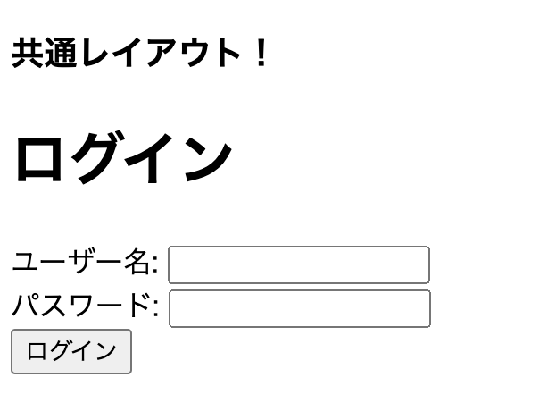

# Nextjs-approuter

`nextjs 13.4` の AppRouter を使用したサンプルプロジェクト

[公式 Document](https://nextjs.org/docs/app)

## how to

```sh
npm run dev   開発サーバ起動
npm run build 本番環境のためのビルド
npm run start 本番サーバ起動
npm run lint  Lintチェック
```

http://localhost:3000/ にアクセスすると以下の画面が表示される

(擬似的な認証機能を付与)



## basic information

`Pages Router`(`pages/`)から`App Router`(`app/`)に変更された．

※ pages router も利用可能．両方使用した場合は app router が優先される．

- 1 つのルートに対し以下のファイルで構成される．


- ネストされる場合は以下の通り


:warning: page.tsx(.js|jsx|ts)が存在する場合，そのフォルダ名が URL として公開される

### ページ遷移

基本的には以下の２パターン

- [\<Link\>](https://nextjs.org/docs/app/building-your-application/routing/linking-and-navigating#link-component)
- [useRouter](https://nextjs.org/docs/app/building-your-application/routing/linking-and-navigating#userouter-hook)

**ただし，`useRouter`はクライアントサイドでのみ利用可能**

## Tips

### ルーティングの基本構成


- app/ 配下のコンポーネントはデフォルトでは`Server Component`となる

### サーバレンダリングの利点

```text
データ・フェッチ：サーバー・コンポーネントを使用すると、データ・ソースに近いサーバーにデータ・フェッチを移すことができます。これにより、レンダリングに必要なデータのフェッチにかかる時間が短縮され、クライアントが行う必要のあるリクエストの量が減るため、パフォーマンスが向上します。
セキュリティサーバーコンポーネントを使用すると、トークンやAPIキーなどの機密データやロジックを、クライアントに公開するリスクなしにサーバー上に保持できます。
キャッシュ：サーバー上でレンダリングすることで、結果をキャッシュし、後続のリクエストやユーザー間で再利用することができます。これにより、各リクエストで行われるレンダリングとデータ取得の量を減らすことができ、パフォーマンスを向上させ、コストを削減することができます。
バンドルサイズ：Server Components を使用すると、従来はクライアントの JavaScript バンドル サイズに影響を及ぼしていた大規模な依存関係をサーバーに残すことができます。これは、クライアントが Server Components の JavaScript をダウンロード、解析、実行する必要がないため、インターネットの速度が遅いユーザーや性能の低いデバイスを使用しているユーザーにとって有益です。
初期ページロードとファースト・コンテントフル・ペイント（FCP） ：サーバー上では、ページのレンダリングに必要なJavaScriptをクライアントがダウンロード、解析、実行するのを待たずに、ユーザーがすぐにページを表示できるようにHTMLを生成することができます。
検索エンジン最適化とソーシャルネットワーク共有性：レンダリングされたHTMLは、検索エンジンのボットがあなたのページをインデックスしたり、ソーシャルネットワークのボットがあなたのページのソーシャルカードのプレビューを生成するために使用することができます。
ストリーミング：サーバーコンポーネントでは、レンダリング作業をチャンクに分割し、準備ができ次第クライアントにストリーミングすることができます。これにより、ユーザーはサーバー上でページ全体がレンダリングされるのを待つことなく、ページの一部を早めに見ることができます。
```

サーバーレンダリングには以下の 3 つがある

- 静的レンダリング
- 動的レンダリング
- ストリーミング

### プロジェクト初期化時のログ

```sh
❯ npx create-next-app@latest
Need to install the following packages:
  create-next-app@13.4.19
Ok to proceed? (y) y
✔ What is your project named? … nextjs-approuter
✔ Would you like to use TypeScript? … Yes
✔ Would you like to use ESLint? … Yes
✔ Would you like to use Tailwind CSS? … No
✔ Would you like to use `src/` directory? … Yes
✔ Would you like to use App Router? (recommended) … Yes
✔ Would you like to customize the default import alias? … Yes
✔ What import alias would you like configured? … @/*
Creating a new Next.js app in /Users/XXX/YYY/nextjs-approuter.

Using npm.

Initializing project with template: app
```
